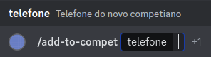
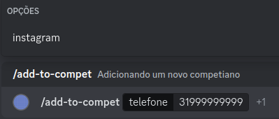
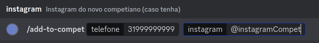

# /add-to-compet

## Descrição

Este comando adiciona um novo membro ao projeto. Ele realiza diversas tarefas automaticamente:
- Adiciona o membro no Trello.
- Adiciona o membro no Discord.
- Adiciona o membro no Google Drive.
- Adiciona o membro em uma planilha de membros.

## Passo a Passo
1. Solicita o número de celular do novo membro. (Campo obrigatório)

2. Opcionalmente, permite a inclusão do Instagram do membro.

3. Exibe um modal para preenchimento das seguintes informações:
    - Nome do membro
    - Email do novo membro
    - Lattes do membro
    - LinkedIn do membro
    - Link de uma foto do membro (deve estar no [ImageBB](#instruções-para-adicionar-imagens-no-imagebb))

### Imagens Exemplificativas:

## Instruções para Adicionar Imagens no ImageBB

1. Acesse o site [ImageBB](https://imgbb.com/).
2. Clique no botão "Start Uploading".
3. Selecione a imagem que deseja fazer upload.
4. Após o upload, copie o link da imagem fornecido.