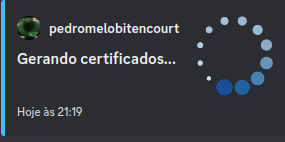
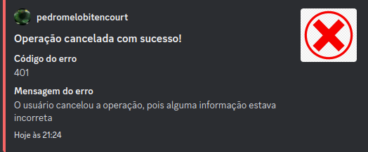

# /certificado-conclusao

## Descrição

Este comando cria um certificado de conclusão (saída) do COMPET para algum competiano ativo

1. Apresentação de um menu de seleção com todos os competianos ativos (no banco de dados)
2. Após selecionar um competiano, é exibido um Modal que pede para digitar algumas informações, sendo elas:
    - Data de entrada do competiano (DD/MM/YYYY)
    - Data de saída do competiano (DD/MM/YYYY)
3. Após o preenchimento do modal, é exibido um texto com o nome do competiano (membro selecionado), a data de entrada e a data de saída
4. Junto ao texto, há três botões: um de **confirmação**, outro de **cancelamento** e outro de **redirecionamento** (redireciona para pasta do Drive que possui os certificados gerados)
5. Por fim, após confirmadas as informações, é gerado um PDF com o nome "Nome do competiano - Certificado Conclusão" no drive do COMPET. O caminho da pasta é: */COMPET/2024/2024.1/Desenvolvimento/Certificados/Conclusão COMPET*  (o caminho pode sofrer modificações). É melhor acessar o local do certificado por meio do botão de redirecionamento
6. Além disso, o certificado é enviado para o Autentique do Sandro para ser assinado (é enviado por meio da conta do COMPET)

### Imagem Exemplificativa:
**Menu com os competianos ativos**

**Modal que pede a data de entrada e a data de saída do competiano**

**Texto com as informações selecionadas e enviadas e botões de confirmação, de cancelamento e de redirecionamento**

**Processamento da geração de certificados**

**Resposta de sucesso após confirmar a operação e gerar os certificados**

**Resposta de sucesso após cancelar a operação**

**Pasta com os PDFs gerados**

* *OBS*: Os PDFs no print são exemplos de teste que fizemos

