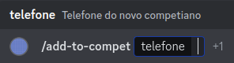
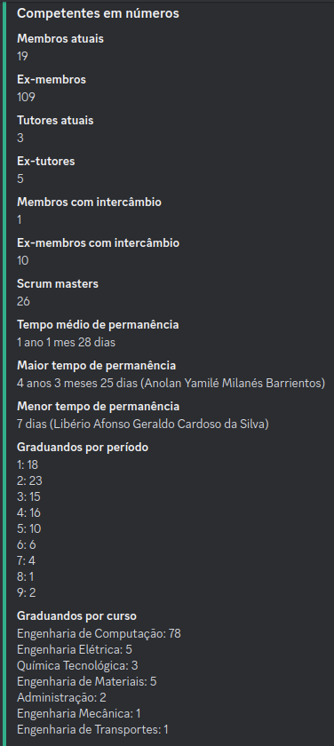
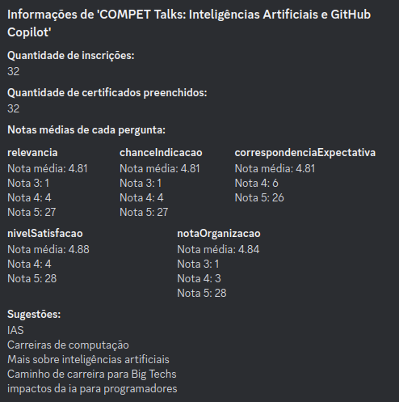
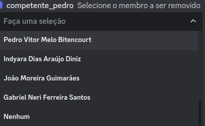
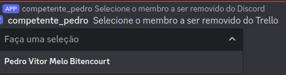
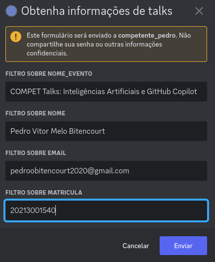
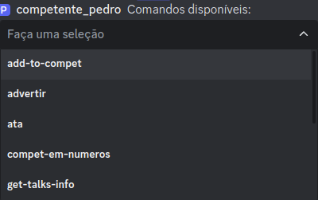

# Documentação do Bot do Discord do COMPET

## Sumário
1. [Comandos do Bot](#comandos-do-bot)
    - [/add-to-compet](#add-to-compet)
    - [/ata](#ata)
    - [/compet-em-numeros](#compet-em-numeros)
    - [/justificar](#justificar)
    - [/lista](#lista)
    - [/talks-feedback](#talks-feedback)
    - [/remove-from-compet](#remove-from-compet)
    - [/advertir](#advertir)
    - [/get-talks-info](#get-talks-info)
    - [/help]()
2. [Instruções para Adicionar Imagens no ImageBB](#instruções-para-adicionar-imagens-no-imagebb)

## Comandos do Bot

### /add-to-compet
Este comando adiciona um novo membro ao projeto. Ele realiza diversas tarefas automaticamente:
- Adiciona o membro no Trello.
- Adiciona o membro no Discord.
- Adiciona o membro no Google Drive.
- Adiciona o membro em uma planilha de membros.

#### Passos:
1. Solicita o número de celular do novo membro. (Campo obrigatório)

2. Opcionalmente, permite a inclusão do Instagram do membro.

3. Exibe um modal para preenchimento das seguintes informações:
    - Nome do membro
    - Email do novo membro
    - Lattes do membro
    - LinkedIn do membro
    - Link de uma foto do membro (deve estar no [ImageBB](#instruções-para-adicionar-imagens-no-imagebb))

#### Imagens Exemplificativas:

### /ata
Este comando retorna um link para o formulário que deve ser preenchido para registrar a ata da reunião geral.

### /compet-em-numeros
Este comando lista diversos dados sobre o projeto, incluindo:
- Quantidade de membros atuais
- Quantidade de ex-membros
- Quantidade de tutores atuais
- Quantidade de ex-tutores
- Quantidade de membros com intercâmbio
- Quantidade de ex-membros com intercâmbio
- Quantidade de scrum masters que já teve
- Tempo médio de permanência dos membros no projeto
- Maior tempo de permanência no projeto e quem foi
- Menor tempo de permanência e quem foi
- Quantidade de graduandos por período (1 a 10)
- Quantidade de graduandos por curso (Engenharia de Computação, Engenharia Elétrica, Química Tecnológica, Engenharia de Materiais, Administração, Engenharia Mecânica, Engenharia de Transportes)

#### Imagem Exemplificativa:

### /justificar
Este comando retorna o link para justificar ausência em uma reunião.

### /lista
Este comando retorna o link da lista de presença.

### /talks-feedback
Este comando retorna informações sobre uma palestra do projeto. O processo inclui:
1. Apresentação de um menu de seleção com as 25 palestras mais recentes.
2. Após selecionar uma palestra, são exibidas estatísticas detalhadas, incluindo:
    - Quantidade de inscrições
    - Quantidade de certificados preenchidos
    - Notas médias de cada pergunta com a quantidade de votos para cada nota
    - Sugestões dos expectadores
3. Por fim, é criado um docs com o nome "Feedback de COMPET Talks: nome do talks" no drive do COMPET com as estatísticas retornadas. O caminho da pasta é: */COMPET/2023/2023.2/Desenvolvimento/Feedback Talks*

#### Perguntas Avaliadas:
- Relevância para o espectador
- Chance de indicação
- Correspondência de expectativa
- Nível de satisfação
- Nota para organização

#### Imagem Exemplificativa:

### /remove-from-compet
Este comando remove um membro do projeto (COMPET) em várias etapas, abrangendo diferentes plataformas onde o projeto está presente. O processo é interativo e guiado por menus de seleção. Abaixo está o detalhamento de cada etapa do comando.

#### Passo a Passo:

1. **Seleção de Membro para Remover do Drive e Alterar o Status no Banco de Dados:**
    - **Explicação:** Primeiro, o bot apresenta um menu de seleção com todos os membros ativos, exceto os tutores. Caso o número de membros seja maior que 24, há a opção de "Próximo" para navegar entre as páginas de membros.
    - **Opções de Navegação:**
        - **Próximo:** Passa para a próxima página de membros.
        - **Anterior:** Volta para a página anterior de membros.
        - **Nenhum:** Seleciona nenhum membro para remoção do drive e para modificação do status no banco de dados.
    - **Mensagens Possíveis:**
        - Sucesso ao remover do drive e atualizar o status no banco de dados.
        - Email incorreto: o email do membro no banco de dados não estava na pasta do drive.
        - Erro ao tentar remover do drive ou atualizar o status no banco de dados.

    

2. **Seleção de Membro para Remover do Discord:**
    - **Explicação:** Após o primeiro passo, o bot apresenta um segundo menu de seleção para remover o membro do Discord do projeto. Similarmente, é possível navegar pelas páginas de membros.
    - **Opções de Navegação:**
        - **Próximo:** Passa para a próxima página de membros.
        - **Anterior:** Volta para a página anterior de membros.
        - **Nenhum:** Seleciona nenhum membro para remoção do Discord.
    - **Mensagens Possíveis:**
        - Sucesso ao remover do Discord.
        - Erro ao tentar remover do Discord.

    

3. **Seleção de Membro para Remover do Trello Geral e da Equipe:**
    - **Explicação:** Finalmente, o bot apresenta um terceiro menu de seleção para remover o membro do Trello geral do projeto e do Trello da equipe específica. Aqui, também é possível navegar entre as páginas de membros.
    - **Opções de Navegação:**
        - **Próximo:** Passa para a próxima página de membros.
        - **Anterior:** Volta para a página anterior de membros.
        - **Ignorar Mensagem:** Se o membro não precisa ser removido do Trello ou já saiu, apenas selecione a opção "Ignorar mensagem" que estará logo abaixo do select menu.
    - **Mensagens Possíveis:**
        - Sucesso ao remover do Trello geral e da equipe.
        - Erro ao tentar remover do Trello.

    

### Fluxo de Navegação
1. **Primeiro Menu:**
    - Exibe os membros para remoção do drive e banco de dados.
    - Navegação: "Próximo", "Anterior", "Nenhum".
2. **Segundo Menu:**
    - Exibe os membros para remoção do Discord.
    - Navegação: "Próximo", "Anterior", "Nenhum".
3. **Terceiro Menu:**
    - Exibe os membros para remoção do Trello geral e da equipe.
    - Navegação: "Próximo", "Anterior", "Ignorar Mensagem".

### Mensagens de Sucesso e Erro
Após cada etapa de seleção, o bot fornece mensagens de feedback:
- **Mensagens de Sucesso:** Confirmação de que a ação foi concluída com sucesso, como "Membro removido do drive e status atualizado com sucesso."
- **Mensagens de Erro:** Indicação de problemas, como "Erro ao tentar remover o membro do Discord. Tente novamente."

### /advertir

Este comando adverte, isto é, dá uma advertência a um membro. Deve-se preencher duas informações:

* Nome de quem será advertido

* O(s) motivo(s) da advertência. Caso haja mais de um motivo, separe-os entre ponto e vírgula (;)

### /get-talks-info

#### Descrição

O comando `get-talks-info` do bot possui 5 filtros: nome do evento (palestra), data do evento, nome da pessoa, email e matrícula. Esse comando permite obter o número de respostas no formulário de certificado, utilizando de um a cinco desses filtros simultaneamente.

#### Passo a Passo

1. **Digite o Comando**: Digite `/get-talks-info` no chat do Discord.
2. **Seleção de Filtros**: Uma caixa de seleção aparecerá com os seguintes filtros disponíveis:
   - Nome do evento (palestra)
   - Data do evento
   - Nome da pessoa
   - Email
   - Matrícula

3. **Escolha dos Filtros**: Selecione no mínimo 1 e no máximo 5 filtros conforme necessário.
4. **Confirmação da Seleção**: Clique fora do menu de seleção para confirmar os filtros escolhidos e iniciar o processamento.
5. **Preenchimento das Informações**: Um modal (formulário) aparecerá para que você insira as informações correspondentes aos filtros selecionados.
6. **Envio das Informações**: Após preencher todos os campos do formulário, clique em "Enviar".
7. **Resultado**: O bot retornará a quantidade de registros que correspondem a todos os filtros selecionados.

#### Imagens Exemplificativas:

**Menu de Seleção dos Filtros**

**Seleção de Filtros**

**Preenchimento do Formulário**

**Resposta Retornada**

## Instruções para Adicionar Imagens no ImageBB

1. Acesse o site [ImageBB](https://imgbb.com/).
2. Clique no botão "Start Uploading".
3. Selecione a imagem que deseja fazer upload.
4. Após o upload, copie o link da imagem fornecido.

### /help

#### Descrição

O comando `/help` fornece uma interface interativa para visualizar e obter informações detalhadas sobre todos os comandos disponíveis do bot. Ele apresenta um menu de seleção (select menu) com uma lista de comandos, e ao selecionar um comando específico, exibe a documentação correspondente.

#### Passo a Passo

1. **Digite o Comando:**
   No chat, digite `/help` e envie a mensagem.

2. **Selecione um Comando:**
   O bot responderá com um select menu contendo todos os comandos disponíveis. Use o menu para selecionar o comando sobre o qual você deseja mais informações.

3. **Visualize a Documentação:**
   Após selecionar um comando, o bot exibirá uma mensagem com a documentação detalhada do comando escolhido.

#### Imagens Exemplificativas:

**Select menu do comando */help***

**Saída do comando */help* ao selecionar o comando */get-talks-info***

