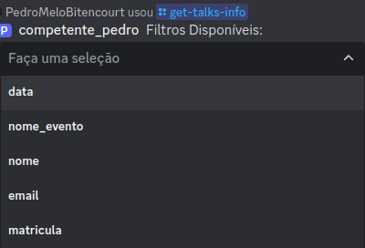
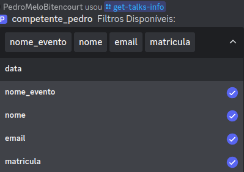
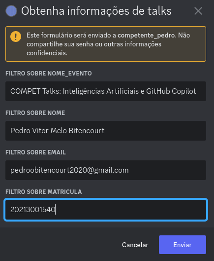
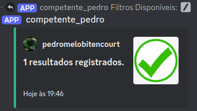

# /get-talks-info

## Descrição

O comando `get-talks-info` do bot possui 5 filtros: nome do evento (palestra), data do evento, nome da pessoa, email e matrícula. Esse comando permite obter o número de respostas no formulário de certificado, utilizando de um a cinco desses filtros simultaneamente.

## Passo a Passo

1. **Digite o Comando**: Digite `/get-talks-info` no chat do Discord.
2. **Seleção de Filtros**: Uma caixa de seleção aparecerá com os seguintes filtros disponíveis:
   - Nome do evento (palestra)
   - Data do evento
   - Nome da pessoa
   - Email
   - Matrícula

3. **Escolha dos Filtros**: Selecione no mínimo 1 e no máximo 5 filtros conforme necessário.
4. **Confirmação da Seleção**: Clique fora do menu de seleção para confirmar os filtros escolhidos e iniciar o processamento.
5. **Preenchimento das Informações**: Um modal (formulário) aparecerá para que você insira as informações correspondentes aos filtros selecionados.
6. **Envio das Informações**: Após preencher todos os campos do formulário, clique em "Enviar".
7. **Resultado**: O bot retornará a quantidade de registros que correspondem a todos os filtros selecionados.

## Imagens Exemplificativas:

**Menu de Seleção dos Filtros**

**Seleção de Filtros**

**Preenchimento do Formulário**

**Resposta Retornada**

