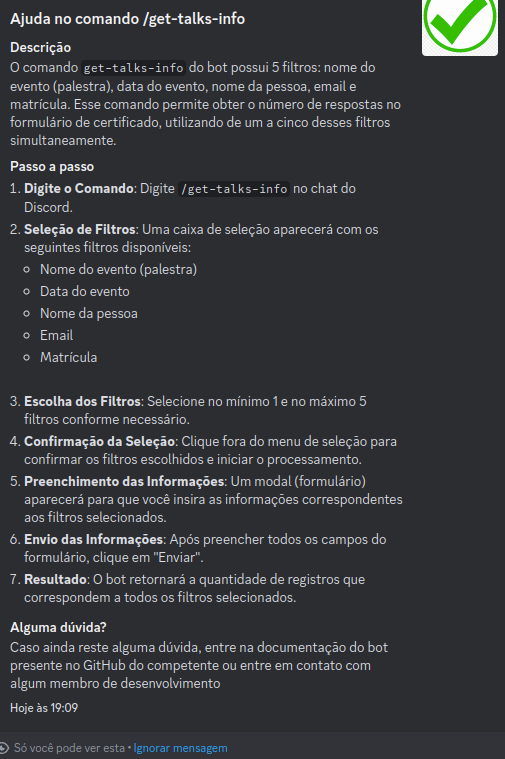

# /help

## Descrição

O comando `/help` fornece uma interface interativa para visualizar e obter informações detalhadas sobre todos os comandos disponíveis do bot. Ele apresenta um menu de seleção (select menu) com uma lista de comandos, e ao selecionar um comando específico, exibe a documentação correspondente.

## Passo a Passo

1. **Digite o Comando:**
   No chat, digite `/help` e envie a mensagem.

2. **Selecione um Comando:**
   O bot responderá com um select menu contendo todos os comandos disponíveis. Use o menu para selecionar o comando sobre o qual você deseja mais informações.

3. **Visualize a Documentação:**
   Após selecionar um comando, o bot exibirá uma mensagem com a documentação detalhada do comando escolhido.

### Imagens Exemplificativas:

**Select menu do comando */help***

**Saída do comando */help* ao selecionar o comando */get-talks-info***

