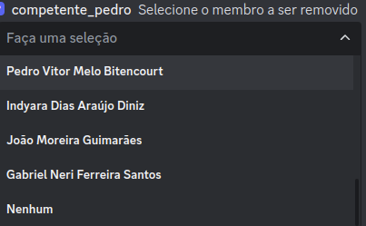
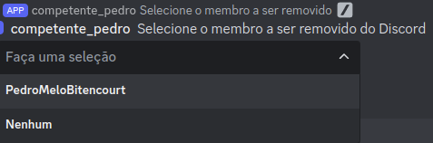
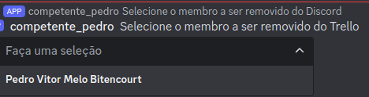

# /remove-from-compet

## Descrição

Este comando remove um membro do projeto (COMPET) em várias etapas, abrangendo diferentes plataformas onde o projeto está presente. O processo é interativo e guiado por menus de seleção. Abaixo está o detalhamento de cada etapa do comando.

Ele remove o membro do drive do projeto, altera seu status no banco de dados e na planilha de membros. Além disso, ele remove o membro do Discord do projeto e do Trello (geral e da sua equipe)

## Passo a Passo

1. **Seleção de Membro para Remover do Drive e Alterar o Status no Banco de Dados e na Planilha de Membros:**
    - **Explicação:** Primeiro, o bot apresenta um menu de seleção com todos os membros ativos, exceto os tutores. Caso o número de membros seja maior que 24, há a opção de "Próximo" para navegar entre as páginas de membros.
    - **Opções de Navegação:**
        - **Próximo:** Passa para a próxima página de membros.
        - **Anterior:** Volta para a página anterior de membros.
        - **Nenhum:** Seleciona nenhum membro para remoção do drive e para modificação do status no banco de dados.
    - **Mensagens Possíveis:**
        - Sucesso ao remover do drive e atualizar o status no banco de dados.
        - Email incorreto: o email do membro no banco de dados não estava na pasta do drive.
        - Erro ao tentar remover do drive ou atualizar o status no banco de dados.

    

2. **Seleção de Membro para Remover do Discord:**
    - **Explicação:** Após o primeiro passo, o bot apresenta um segundo menu de seleção para remover o membro do Discord do projeto. Similarmente, é possível navegar pelas páginas de membros.
    - **Opções de Navegação:**
        - **Próximo:** Passa para a próxima página de membros.
        - **Anterior:** Volta para a página anterior de membros.
        - **Nenhum:** Seleciona nenhum membro para remoção do Discord.
    - **Mensagens Possíveis:**
        - Sucesso ao remover do Discord.
        - Erro ao tentar remover do Discord.

    

3. **Seleção de Membro para Remover do Trello Geral e da Equipe:**
    - **Explicação:** Finalmente, o bot apresenta um terceiro menu de seleção para remover o membro do Trello geral do projeto e do Trello da equipe específica. Aqui, também é possível navegar entre as páginas de membros.
    - **Opções de Navegação:**
        - **Próximo:** Passa para a próxima página de membros.
        - **Anterior:** Volta para a página anterior de membros.
        - **Ignorar Mensagem:** Se o membro não precisa ser removido do Trello ou já saiu, apenas selecione a opção "Ignorar mensagem" que estará logo abaixo do select menu.
    - **Mensagens Possíveis:**
        - Sucesso ao remover do Trello geral e da equipe.
        - Erro ao tentar remover do Trello.

    

### Fluxo de Navegação
1. **Primeiro Menu:**
    - Exibe os membros para remoção do drive e banco de dados.
    - Navegação: "Próximo", "Anterior", "Nenhum".
2. **Segundo Menu:**
    - Exibe os membros para remoção do Discord.
    - Navegação: "Próximo", "Anterior", "Nenhum".
3. **Terceiro Menu:**
    - Exibe os membros para remoção do Trello geral e da equipe.
    - Navegação: "Próximo", "Anterior", "Ignorar Mensagem".

### Mensagens de Sucesso e Erro
Após cada etapa de seleção, o bot fornece mensagens de feedback:
- **Mensagens de Sucesso:** Confirmação de que a ação foi concluída com sucesso, como "Membro removido do drive e status atualizado com sucesso."
- **Mensagens de Erro:** Indicação de problemas, como "Erro ao tentar remover o membro do Discord. Tente novamente."