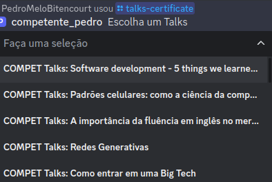
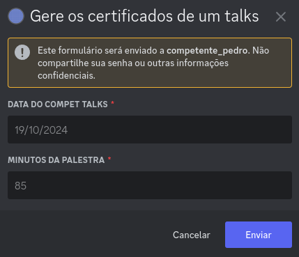
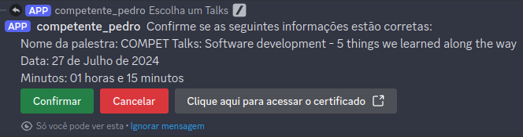
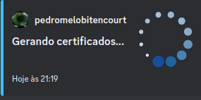
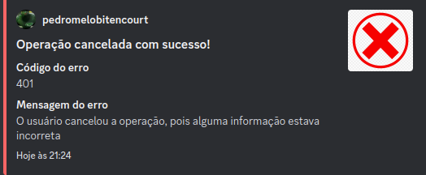
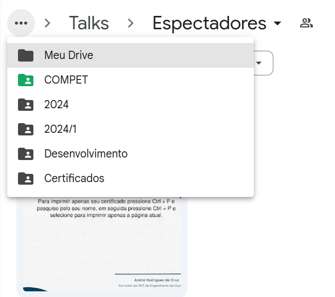

# /talks-certificate

## Descrição

Este comando cria um PDF com múltiplas páginas, uma para cada pessoa que preencheu o formulário de certificado (sendo que a primeira é uma página com instruções de como imprimir/baixar apenas uma página)

1. Apresentação de um menu de seleção com as 25 palestras mais recentes.
2. Após selecionar uma palestra, é exibido um Modal que pede para digitar algumas informações, sendo elas:
    - Data do talks
    - Duração do talks (em minutos)
3. Após o preenchimento do modal, é exibido um texto com o nome do Talks, a data do Talks e a duração do Talks
4. Junto ao texto, há três botões: um de **confirmação**, outro de **cancelamento** e outro de **redirecionamento**
4. Por fim, é gerado um PDF com o nome "Nome do Talks - Data do Talks - Certificados" no drive do COMPET. O caminho da pasta é: */COMPET/2024/2024.1/Desenvolvimento/Certificados*

### Imagem Exemplificativa:
**Menu com os talks**

**Modal que pede a data do evento e sua duração**

**Texto com as informações selecionadas e enviadas e botões de confirmação, de cancelamento e de redirecionamento**

**Processamento da geração de certificados**

**Resposta de sucesso após confirmar a operação e gerar os certificados**

**Resposta de sucesso após cancelar a operação**

**Pasta com os PDFs gerados**

* *OBS*: Os PDFs no print são exemplos de teste que fizemos

