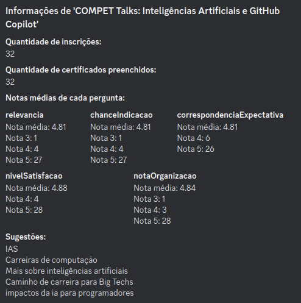
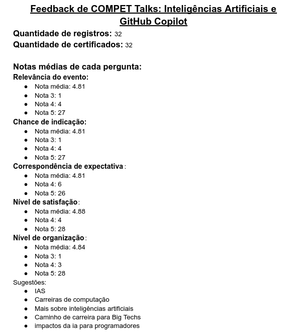

# /talks-feedback

## Descrição

Este comando retorna informações sobre uma palestra do projeto. O processo inclui:
1. Apresentação de um menu de seleção com as 25 palestras mais recentes.
2. Após selecionar uma palestra, são exibidas estatísticas detalhadas, incluindo:
    - Quantidade de inscrições
    - Quantidade de certificados preenchidos
    - Notas médias de cada pergunta com a quantidade de votos para cada nota
    - Sugestões dos expectadores
3. Por fim, é criado um docs com o nome "Feedback de COMPET Talks: nome do talks" no drive do COMPET com as estatísticas retornadas. O caminho da pasta é: */COMPET/2023/2023.2/Desenvolvimento/Feedback Talks*

## Perguntas Avaliadas:
- Relevância para o espectador
- Chance de indicação
- Correspondência de expectativa
- Nível de satisfação
- Nota para organização

### Imagem Exemplificativa:
**Modal retornado no Discord**

**O Docs na pasta do Drive**

